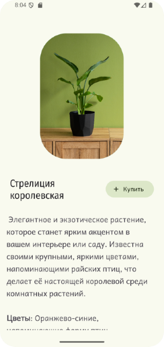
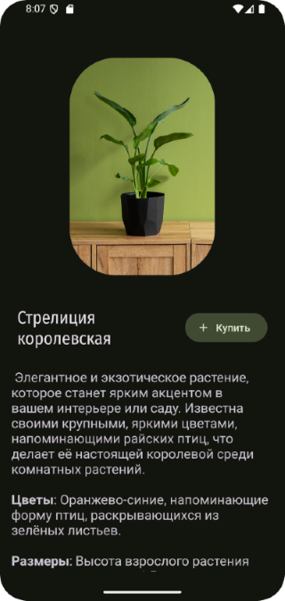

# Домашнее задание по теме "Themes"

## Приложение «Кастомные темы страницы товара»

Необходимо написать приложение с одним экраном, на котором располагается изображение товара, его название, описание и кнопка «Купить». Для работы приложения и демонстрации смены тем необходимо создать две кастомные темы: светлую и темную. Они должны меняться в зависимости от установленной темы устройства. Необходимо учесть, что при переключении обеих тем, текст должен оставаться читаемым, цветовая гамма приложения должна быть гармонично выстроена (т.е. при переключении на темную тему, кнопка, которая задана в темных тонах при светлой теме, должна быть видна и т.д).

Для работы приложения необходимо создать:

На экране:

1. `ImageView` картинки товара.
2. `TextView` названия товара.
3. `TextView` описания товара.
4. Кнопка «Купить».

## Скриншоты к домашнему заданию по теме "Themes" 

   

Скриншоты здесь

